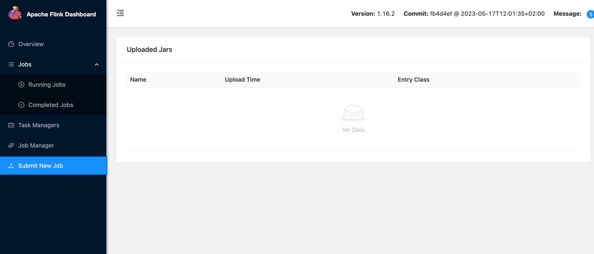

# Apache Beam Kafka Ingest to Cassandra

If you want to clone this repository to start your own project,
you can choose the license you prefer and feel free to delete anything related to the license you are dropping.

## Before you begin

Make sure you have a [Java](https://en.wikipedia.org/wiki/Java_%28programming_language%29) development environment ready.
If you don't, an easy way to install it is with [`sdkman`](https://sdkman.io).

```sh
# Install sdkman.
curl -s "https://get.sdkman.io" | bash

# Make sure you have Java 11 installed.
sdk install java openjdk version "11.0.20.1"
```

## Source file structure

This is a very basic Apache Beam project to help you get started.

There are only two source files:

* [`src/main/java/com/realtime/pipelines/IovationToCassandraApp.java`](src/main/java/com/realtime/pipelines/IovationToCassandraApp.java): the application source file, containing the [`main` method](src/main/java/com/example/App.java). The _main class_ is `com.realtime.pipelines.IovationToCassandraApp`.

> ℹ️ Most build tools expect all the Java source files to be under `src/main/java/` and tests to be under `src/test/java/` by default.

### Option A: Gradle _(recommended)_

[Gradle](https://gradle.org) is a build tool focused on flexibility and performance.

This is a build tool widely used by many projects.

```sh
sdk install gradle
```

A basic Gradle setup consists of a [`build.gradle`](build.gradle) file written in [Groovy](https://groovy-lang.org) or [Kotlin](https://kotlinlang.org).

```sh
# To do a simple run.
gradle run

# To run passing command line arguments.
gradle run --args=--configFile="<ingestConfigurationFile>"

# To run the tests.
gradle test --info
```

To build a self-contained jar file, we need to configure the [`jar`](https://docs.gradle.org/current/dsl/org.gradle.api.tasks.bundling.Jar.html) task in the [`build.gradle`](build.gradle) file.

```sh
# Build a self-contained jar.
gradle jar

# Run the jar application.
java -jar build/pipelineIovationToCassandra.jar --configFile="<ingestConfigurationFile>"
```

# Deployment Application on Apache Flink
* [`Docker Flink/docker-compose.yml`](Docker Flink/docker-compose.yml)
```
docker-compose up
```

# Submit Real Time Application (jar) on Apache Flink


# Test Different Ingestion Process from Kafka to Cassandra
* [`resources/config/ingestConfigurationFile.json`](resources/config)
```
{
  "inputTopic": "enrichment.fct.iovation.v1",
  "cassandraNodes": "cassandra://54.152.221.55:9042",
  "cassandraKeyspace": "iovation_data_source",
  "cassandraTable": "iovation_default",
  "fields": [
    "content.data.id",
    "content.data.result.details.device.os",
    "content.data.result.details.realIp.isp"
  ],
  "tableSchema": {
    "id": "UUID",
    "os": "TEXT",
    "isp": "TEXT"
  }
}
```
# Other options for this project

### Option B: sbt

[`sbt` (Scala Build Tool)](https://www.scala-sbt.org/index.html) is a type-safe build tool for Scala and Java projects.
Since it's type-safe, most errors are caught before the build starts.

This is probably the simplest option, but isn't as widely used as Gradle.

```sh
sdk install sbt
```

A basic `sbt` setup consists of a [`build.sbt`](build.sbt) file written in a Scala-based DSL, and optionally a [`project/plugins.sbt`](project/plugins.sbt) file.

```sh
# To do a simple run.
sbt run

# To run passing command line arguments.
sbt 'run --configFile="<ingestConfigurationFile>"'

# To run the tests.
sbt test
```

To build a self-contained jar file, we need to import [`sbt-assembly`](https://github.com/sbt/sbt-assembly) in the [`project/plugins.sbt`](project/plugins.sbt) file and configure it in the [`build.sbt`](build.sbt) file.

```sh
# Build a self-contained jar.
sbt assembly

# Run the jar application.
java -jar build/pipelineIovationToCassandra.jar --configFile="data_pipeline_config.json"
```

### Option C: Apache Maven

[Apache Maven](http://maven.apache.org) is a project management and comprehension tool based on the concept of a project object model (POM).

This is by far the trickiest to configure, but many older projects still use it.

If you are starting a new project, we recommend using Gradle or `sbt` instead.

> ℹ️ If you have an existing Maven project, consider looking at a [Gradle vs Maven comparison](https://gradle.org/maven-vs-gradle), as well as Gradle's [Migrating builds from Apache Maven](https://docs.gradle.org/current/userguide/migrating_from_maven.html) guide.

```sh
sdk install maven
```

A basic Apache Maven setup consists of a [`pom.xml`](pom.xml) file written in [XML](https://www.w3schools.com/xml).

To run the app through Maven, we need to configure [`exec-maven-plugin`](http://www.mojohaus.org/exec-maven-plugin) in the [`pom.xml`](pom.xml) file.

```sh
# To do a simple run.
mvn compile exec:java

# To run passing command line arguments.
mvn compile exec:java -Dexec.args=--configFile="<ingestConfigurationFile>"

# To run the tests.
mvn test
```

To build a self-contained jar file, we need to configure [`maven-assembly-plugin`](https://people.apache.org/~epunzalan/maven-assembly-plugin/index.html) in the [`pom.xml`](pom.xml) file.

```sh
# Build a self-contained jar.
mvn package

# Run the jar application.
java -jar target/beam-kafka-cassandra-1-jar-with-dependencies.jar --configFile="<ingestConfigurationFile>"
```

# License

This software is distributed under the terms of both the MIT license and the
Apache License (Version 2.0).

See [LICENSE](LICENSE) for details.
